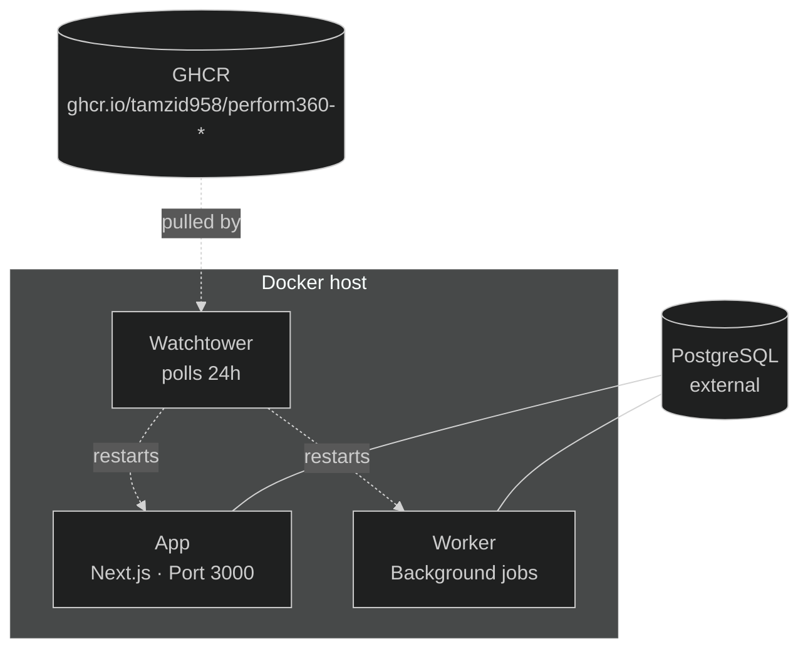

# Performs360

[](LICENSE)
[](https://github.com/tamzid958/perform360/actions/workflows/build.yml)

Self-hosted 360-degree performance review platform. Run reviews, collect multi-source feedback, and generate calibrated reports — all on your own infrastructure.

Pre-built Docker images are published to GitHub Container Registry on every release. Watchtower keeps your install up-to-date automatically.

## Quick install

```bash
# 1. Pick a directory
mkdir performs360 && cd performs360

# 2. Grab the compose file
curl -fsSL https://raw.githubusercontent.com/tamzid958/perform360/master/docker-compose.yml -o docker-compose.yml

# 3. Create your .env (see "Environment Variables" below)
curl -fsSL https://raw.githubusercontent.com/tamzid958/perform360/master/.env.production.example -o .env
$EDITOR .env

# 4. Pull and start
docker compose pull
docker compose up -d
```

That's it. The app comes up on port `3000`. Auto-updates run within 24 hours of each new release; the running services are restarted in place by Watchtower.

After first boot, visit `/setup-encryption` to initialize encryption keys.

### Prerequisites

- **Docker** with Docker Compose
- **PostgreSQL** (external — bring your own; set `DATABASE_URL`)

## Environment Variables

| Variable | Required | Description |
|----------|----------|-------------|
| `DATABASE_URL` | Yes | PostgreSQL connection string |
| `NEXTAUTH_SECRET` | Yes | Random secret (`openssl rand -base64 32`) |
| `NEXTAUTH_URL` | Yes | Your app's public URL |
| `NEXT_PUBLIC_APP_URL` | Yes | Same as `NEXTAUTH_URL` |
| `EMAIL_PROVIDER` | Yes | `resend`, `brevo`, or `smtp` |
| `EMAIL_FROM` | Yes | Sender address for emails |
| `RESEND_API_KEY` | If resend | Resend API key |
| `BREVO_API_KEY` | If brevo | Brevo API key |
| `SMTP_HOST` | If smtp | SMTP server host |
| `SMTP_PORT` | If smtp | SMTP server port |
| `SMTP_USER` | If smtp | SMTP username |
| `SMTP_PASS` | If smtp | SMTP password |
| `APP_PORT` | No | Host port (default `3000`) |
| `WATCHTOWER_POLL_INTERVAL` | No | Seconds between update checks (default `86400` = 24h) |

## Architecture



**Services:**

- **app** — Next.js standalone server. Runs `prisma db push` on startup so schema migrations ride along with image updates.
- **worker** — Background job processor (cycle auto-close, OTP cleanup, email sends, audit-log retention).
- **watchtower** — Monitors GHCR every 24 hours and restarts containers when a newer image is published.

## Versioning & releases

Releases are cut by tagging a version and pushing it:

```bash
# Maintainer flow
npm version 1.2.0 --no-git-tag-version
git commit -am "chore: bump to v1.2.0"
git tag v1.2.0
git push origin master --tags
```

The [`build.yml`](.github/workflows/build.yml) workflow fires on each `v*` tag, builds amd64 + arm64 images for both `app` and `worker` services, publishes them to GHCR (`:latest`, `:1.2.0`, `:sha-xxxxxxx`), and creates a GitHub Release with auto-generated release notes.

Self-hosted instances see the new version surface in **Settings → Update available** banner within an hour. Watchtower swaps the running containers within 24 hours of publish.

## Management

```bash
docker compose logs -f          # All services
docker compose logs -f app      # App only
docker compose down             # Stop
docker compose restart          # Restart
docker compose pull && docker compose up -d  # Force update now (skip Watchtower wait)
```

## Tech Stack

- **Framework:** Next.js 16 (App Router, standalone output)
- **Database:** PostgreSQL 16 + Prisma ORM
- **Auth:** NextAuth.js v5
- **UI:** Tailwind CSS, Radix UI, Recharts
- **Email:** Resend / Brevo / SMTP (Nodemailer)
- **Language:** TypeScript (strict mode)
- **Container registry:** GitHub Container Registry (GHCR)
- **Auto-update:** Watchtower

## Contributing

See [CONTRIBUTING.md](.github/CONTRIBUTING.md) for development setup and guidelines.

Please note that this project follows a [Code of Conduct](.github/CODE_OF_CONDUCT.md).

## Security

To report a vulnerability, see [SECURITY.md](.github/SECURITY.md).

## License

Licensed under the [Business Source License 1.1](LICENSE). After the change date (2030-03-28), the code converts to Apache License 2.0.
