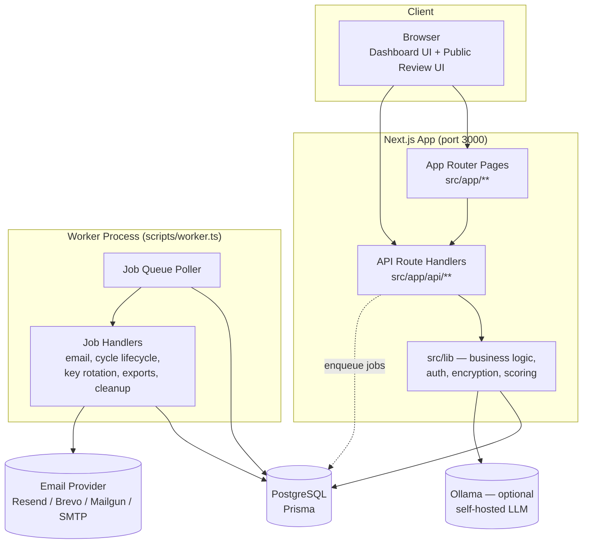
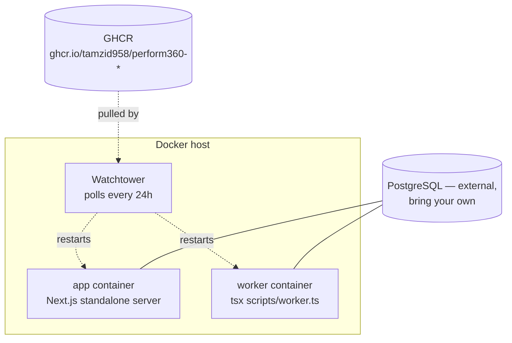
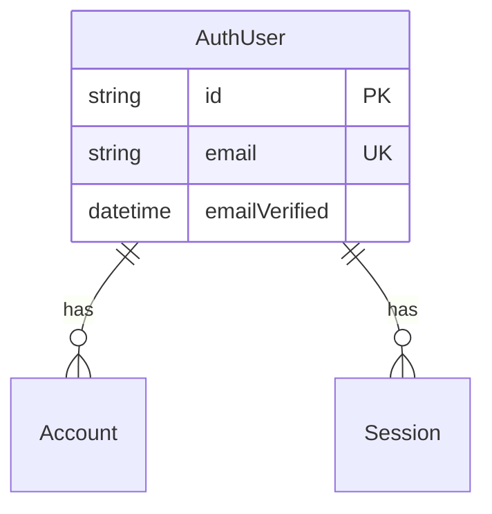
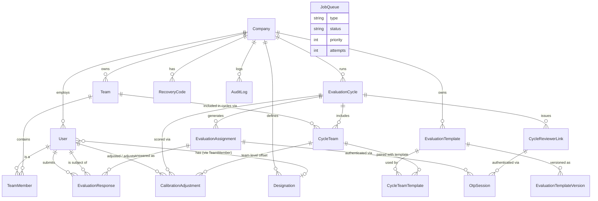

# Performs360 — Engineering Overview

Self-hosted 360-degree performance review platform. Companies run evaluation cycles where employees are reviewed from multiple directions (manager, peers, self, external reviewers), collect encrypted feedback, calibrate scores, and generate reports — all on infrastructure the company controls.

This document is a full map of the codebase: stack, architecture, data model, module responsibilities, API surface, frontend routes, background jobs, and the core business rules that make a "360 review" actually work. Use it as source material for a mindmap or as an onboarding reference.

---

## 1. Tech Stack

| Layer | Technology |
|---|---|
| Framework | Next.js 16 (App Router), React 18 |
| Language | TypeScript |
| Database | PostgreSQL, accessed via Prisma ORM (`@prisma/client` v5) |
| Auth | NextAuth v5 (beta) — magic-link email auth for dashboard users, custom OTP system for reviewers |
| State (client) | Zustand |
| Forms | react-hook-form + Zod |
| Styling | Tailwind CSS, Radix UI primitives (shadcn-style component layer) |
| Drag & drop | dnd-kit (template/question builder, section reordering) |
| Rich text | TipTap |
| Charts | Recharts |
| Email providers | Resend, Brevo, Mailgun, SMTP (nodemailer), or console (dev) — selected via `EMAIL_PROVIDER` env var, behind a common abstraction |
| PDF / Excel | pdfkit, exceljs, jszip |
| Encryption | Node `crypto` — AES-256-GCM for data at rest, scrypt for passphrase-derived keys, bcryptjs for OTPs/recovery codes |
| Background jobs | Postgres-backed job queue (custom, not Redis/BullMQ) — polled by a standalone worker process |
| Testing | Vitest (unit/integration/contract), Playwright (e2e + accessibility via axe-core) |
| Optional AI | Ollama integration (self-hosted LLM) for feedback summarization |
| Deployment | Docker images published to GHCR, `docker compose` with Watchtower for auto-updates; PM2 (`ecosystem.config.cjs`) as an alternative to Docker |

---

## 2. High-Level Architecture



The Next.js `app` container and the `worker` container share one Postgres database and communicate only through the `JobQueue` table — there's no direct RPC between them. The API enqueues jobs (send email, activate cycle, export report, rotate encryption key); the worker polls and executes them.

### Deployment topology (production)



`app` runs `prisma db push` on container startup, so schema changes ship with each image release. No separate migration step for self-hosted installs.

---

## 3. Data Model

Two authentication identities exist side by side, plus the core business schema. Full source: `prisma/schema.prisma`.

### 3.1 NextAuth identity tables (dashboard login only)



`VerificationToken` (magic-link tokens) is not tied to a specific user row — matched by email+token at consumption time.

### 3.2 Core business schema



### 3.3 Key models and what they mean in business terms

| Model | Business meaning |
|---|---|
| `Company` | Singleton per self-hosted instance. Owns the company-wide AES data key (`encryptionKeyEncrypted`), which gates access to all evaluation content. |
| `User` | An employee/reviewer inside a company. Distinct from `AuthUser` — `User` is business identity (role, company, teams); `AuthUser` is login identity (NextAuth session). Linked by `authUserId` and by email lookup in the `signIn` callback. |
| `UserRole` | `ADMIN`, `HR`, `MEMBER`, `EXTERNAL`. Only `ADMIN`/`HR` can log into the dashboard. |
| `Team` | Grouping of users that a cycle is run against. |
| `TeamMember` | A user's membership in a team, with a `TeamMemberRole` (`MANAGER`, `MEMBER`, `EXTERNAL`, `IMPERSONATOR`) and optional `designationId`. This role, not `UserRole`, drives 360 direction routing (who reviews whom). |
| `Designation` | Job title/level (e.g. "SE L-1"). Used to route templates and filter which template applies to which employee. |
| `EvaluationTemplate` | A reusable review form: named sections of questions, direction filters per section, optional weight presets. Versioned on every edit (`EvaluationTemplateVersion` is an append-only snapshot log). |
| `EvaluationCycle` | One review period (e.g. "Q2 2026 Review"). Has a lifecycle: `DRAFT → ACTIVE → CLOSED → ARCHIVED`. Holds a cached, encrypted copy of the data key (`cachedDataKeyEncrypted`) so the public submission endpoint can encrypt answers without needing an admin's passphrase live. |
| `CycleTeam` / `CycleTeamTemplate` | Which teams participate in a cycle, and which template(s) apply to each team. Also where team-level calibration offsets live. |
| `EvaluationAssignment` | One (subject, reviewer, direction, template) tuple — the atomic unit of "who reviews whom, using what form, from what angle." Generated automatically from team structure when a cycle is created/activated. Carries a unique `token` used for OTP-gated public access. |
| `CycleReviewerLink` | A per-reviewer, per-cycle summary access token — lets one reviewer see/complete *all* their assignments in a cycle behind a single OTP verification. |
| `OtpSession` | Tracks OTP issuance/verification for the public review flow — expiry, attempt count, cooldown, and (once verified) a session token. |
| `EvaluationResponse` | The actual submitted answers, **encrypted** (`answersEncrypted`/`answersIv`/`answersTag`, AES-256-GCM) — never stored in plaintext. |
| `RecoveryCode` | Bcrypt-hashed one-time codes that let an admin recover the company data key if the passphrase is lost. |
| `CalibrationAdjustment` | Post-scoring manual override: raw score → calibrated score with a required justification, tracked per (cycle, team, subject). |
| `AuditLog` | Append-only record of sensitive actions (decryption, role changes, invites, cycle activation, encryption ops, calibration edits, imports/exports). |
| `JobQueue` | Postgres-backed async task queue — see §6. |

---

## 4. Authentication & Authorization

There are **two independent auth systems** — do not confuse them when tracing a bug.

| System | Who | Mechanism |
|---|---|---|
| Dashboard auth | `ADMIN` / `HR` users | NextAuth v5 magic-link email (5-min token expiry), DB session strategy |
| Evaluation/reviewer auth | `MEMBER` / `EXTERNAL` reviewers filling out forms | Custom 6-digit OTP, bcrypt-hashed, 10-min expiry, 3 attempts then 15-min cooldown, 4-hour post-verify session |

### 4.1 Dashboard login flow

```
/login → POST /api/auth/verify-and-signin
  → rate limit (5 req / 15 min / IP)
  → look up User by email: must exist, not archived, role ∈ {ADMIN, HR}
  → signIn("nodemailer") → NextAuth issues VerificationToken, sends magic-link email
User clicks link → /api/auth/callback/nextauth
  → token verified & consumed → AuthUser upserted → Session row created
  → signIn() callback re-checks the same User constraints (redundant guard)
  → redirect to /overview
```

Notable implementation detail: NextAuth's `PrismaAdapter` is wrapped in a JS `Proxy` (`src/lib/auth.ts`) that redirects its expected `user` model calls to `AuthUser`, because the app's own `User` model uses a composite unique key (`[email, companyId]`) instead of a global unique email — which NextAuth's adapter contract requires.

### 4.2 Reviewer OTP flow

```
Reviewer opens /evaluate/[token] or /review/[token] (assignment/reviewer-link token, no session)
  → requests OTP → 6-digit code generated, bcrypt-hashed, emailed, rate-limited (5/hour/email)
  → submits OTP → bcrypt.compare → on success: session cookie set (4h), OtpSession.verifiedAt stamped
  → on failure: attempts++; 3rd failure → 15-min cooldown
```

`/evaluate/[token]` = single assignment. `/review/[token]` = reviewer-link summary view covering *all* of that reviewer's assignments in the cycle behind one OTP.

A separate, short-lived cookie (`_enc_dk`, `src/lib/encryption-session.ts`) carries the company's decrypted data key (itself encrypted with `NEXTAUTH_SECRET`) so the submission endpoint can AES-encrypt answers without an admin's passphrase being involved at submission time.

### 4.3 Route protection

No Next.js Edge middleware is used — protection happens per-route via higher-order wrappers:

- `src/lib/api-auth.ts` — `requireAuth()`, `requireRole()`, `requireAdminOrHR()`
- `src/lib/middleware/rbac.ts` — `withRBAC()`, `withAdminOrHR()`, `withAdmin()` wrap route handlers and inject `auth.{userId,email,role,companyId}`
- `src/lib/middleware/company-scope.ts` — `withCompanyScope()` verifies a requested resource (cycle/team/template) actually belongs to the caller's company, else 404
- `src/lib/permissions.ts` — UI-facing permission matrix (`canManageCycles`, `canViewReports`, etc.); ADMIN has all 11 perms, HR has 9 (no encryption management), MEMBER/EXTERNAL have none

Full narrative detail (with line references) lives in [`docs/auth-process.md`](auth-process.md) — keep this section as the summary, that file as ground truth.

---

## 5. Encryption Model

All evaluation response content is encrypted at rest — the platform's core privacy guarantee for a self-hosted 360 tool.

- **Algorithm**: AES-256-GCM. Company owns one data key, encrypted under a key derived (scrypt) from the admin's passphrase.
- **Setup**: `/setup-encryption` (mandatory before dashboard use) generates the salt + data key + 8 recovery codes (bcrypt-hashed, shown once).
- **Unlock**: admin enters passphrase → data key decrypted → cached in an httpOnly cookie for the session (`encryption-session.ts`).
- **Cycle-level caching**: on cycle activation, the decrypted data key is re-encrypted and cached on the `EvaluationCycle` row (`cachedDataKeyEncrypted`) so the *public, unauthenticated* submission endpoint can encrypt reviewer answers without needing a live admin passphrase.
- **Recovery**: lost passphrase → one of 8 recovery codes decrypts the data key.
- **Rotation / hard reset**: generates a new salt/key/codes; `jobs/encryption.ts` walks all `EvaluationResponse` rows in batches of 100, decrypts with the old key, re-encrypts with the new one, bumps `keyVersion`.
- **Key version tracking**: every encrypted row stores `keyVersion` so decryption always uses the correct key even mid-rotation.

---

## 6. Background Jobs (Worker)

`scripts/worker.ts` runs as a separate process/container and polls the Postgres `JobQueue` table (`FOR UPDATE SKIP LOCKED`, priority DESC then `runAt` ASC; exponential backoff on failure: 5s/25s/125s; stale-job recovery after 30 min; 7-day retention).

| Job type | Handler | Purpose |
|---|---|---|
| `email.send` | `jobs/email.ts` | Dispatch a queued email through the configured provider |
| `cycle.activate` | `jobs/cycle.ts` | On cycle DRAFT→ACTIVE: batch-email all reviewers their invites |
| `cycle.remind` | `jobs/cycle.ts` | Email reminders to reviewers with pending/in-progress assignments |
| `cycle.auto-close` | `jobs/cycle.ts` | Close ACTIVE cycles past `endDate` or at 100% submission completion |
| `encryption.rotate-key` | `jobs/encryption.ts` | Batch re-encrypt all `EvaluationResponse` rows after key rotation/hard-reset |
| `cleanup.otp-sessions` | `jobs/cleanup.ts` | Purge expired OTP sessions, stale jobs (7d+), old audit logs (365d+) |
| `data.export` | `jobs/data-export.ts` | Full company JSON dump (GDPR-style export) — company, users, teams, templates, cycles, decrypted responses, audit logs |
| `reports.export-cycle-excel` | `jobs/reports-export-excel.ts` | Build cycle + per-subject Excel report workbook, email it |

Job types and payload shapes are declared in `src/types/job.ts`; the registry mapping type → handler is `src/lib/jobs/index.ts`.

---

## 7. The 360° Evaluation Domain Model

This is the actual business logic — the part worth understanding before touching anything.

### 7.1 Directions

Five feedback directions (`Direction` enum): `DOWNWARD`, `UPWARD`, `LATERAL`, `SELF`, `EXTERNAL`. Product-facing labels differ from the enum (renamed in the newer template wizard UI): Downward → "Manager review", Lateral → "Peer review", Self → "Self review", Upward → "Upward review", External → "External review". The underlying enum/data model is unchanged — only display labels moved.

### 7.2 Team roles drive routing

`TeamMemberRole` (`MANAGER`, `MEMBER`, `EXTERNAL`, `IMPERSONATOR`) — distinct from the company-wide `UserRole` (`ADMIN`/`HR`/`MEMBER`/`EXTERNAL`) — determines who reviews whom. `src/lib/assignments.ts` (`generateAssignmentsFromTeams()`) expands a team's membership into concrete `EvaluationAssignment` rows:

- `DOWNWARD`: manager reviews each member
- `UPWARD`: each member reviews their manager
- `LATERAL`: members review each other; managers review each other
- `SELF`: everyone reviews themselves
- `EXTERNAL`: external reviewers review everyone
- `IMPERSONATOR`: a team member configured to review on behalf of specific directions (proxy reviewer), overriding the normal rule for those directions

Assignments are deduplicated on `(cycleId, subjectId, reviewerId, templateId, direction)`.

### 7.3 Template routing

`src/lib/template-routing.ts` resolves which template applies to a given subject:

1. Prefer a template whose `appliesToRole` matches the subject's team role (`MANAGER`/`MEMBER`) over one marked `ANY` (role-agnostic, the legacy default).
2. Within that, prefer a template whose `designationIds` includes the subject's designation over one with an empty (wildcard) list.
3. Section-level filtering: each section can restrict itself to a subset of directions; an empty `directions` array means "visible to all directions."

**Coverage gaps (non-blocking).** A cycle subject (a `MANAGER`/`MEMBER`) is *covered* only when some assigned template matches **both** their team role and designation. If none does, that subject has a coverage gap and **no assignments are generated for them** — they are silently never reviewed and are excluded from reports/stats. `computeCoverageGaps()` in `src/lib/template-routing.ts` is the single shared detector, used by the create/edit wizard preview (`step-teams.tsx`), server validation (`validateTeamTemplateCoverage` in `assignments.ts`), and the `GET /api/cycles/[id]` response.

Gaps do **not** block cycle creation or activation — they surface as a soft warning:
- persistent banner on the cycle detail **Overview** tab (recomputed on each read, so it reflects current team membership — no stored snapshot to drift);
- non-blocking panel in the create/edit wizard Step 2;
- soft-confirm block in the **Activate** dialog.

**Risk & resolution.** Activating a cycle with an unresolved gap makes it permanent: after `DRAFT → ACTIVE`, teams/templates become read-only. **While DRAFT**, fix it by editing the cycle (`PATCH /api/cycles/[id]` deletes and regenerates all assignments) and adding a template whose `designationIds` covers the member — or a wildcard/`ANY`-role template — then confirm the Overview banner clears. **After ACTIVE**, the gap cannot be fixed for that cycle; the uncovered members must wait for the next cycle.

### 7.4 Scoring & weights

- `WeightPreset` enum: `equal`, `supervisor_focus`, `peer_focus`, `custom`. Templates can define separate weight profiles for member-subjects vs manager-subjects (`weightsMember`/`weightsManager`).
- `equal`: 25% each across downward/lateral/self/external (upward = 0 for member-subjects — a manager isn't scored by "upward" review of themselves as subject in the equal preset).
- `supervisor_focus`/`peer_focus`: skew weight toward downward or lateral respectively (~45%).
- `src/lib/reports.ts` decrypts responses, computes per-category and per-direction averages, applies template weights, and computes self-vs-others gap (color-coded: within ±0.5 = aligned, ±1+ = flagged).
- `src/lib/trends.ts` aggregates these per-cycle scores into cross-cycle KPI trends (rolling average vs current cycle).

### 7.5 Calibration

Post-scoring, admins/HR can apply manual adjustments at two levels: a `CycleTeam.calibrationOffset` (blanket team-level nudge, e.g. "-0.5 for a lenient team") and per-subject `CalibrationAdjustment` rows (raw → calibrated score, mandatory justification text, audit-logged).

---

## 8. Module Map — `src/lib`

Grouped by concern. (~55 files total; this lists the load-bearing ones.)

| Area | Files | Responsibility |
|---|---|---|
| Foundational | `prisma.ts`, `constants.ts`, `rate-limit.ts` | DB client singleton, app-wide config (OTP/encryption/job tuning), in-memory rate limiting |
| Auth | `auth.ts`, `api-auth.ts`, `session-validation.ts`, `permissions.ts` | NextAuth config, route auth guards, OTP session validation, role→permission matrix |
| Encryption | `encryption.ts`, `encryption-session.ts`, `crypto-utils.ts`, `otp.ts`, `tokens.ts` | AES-256-GCM encrypt/decrypt, scrypt KDF, cookie-based key transport, OTP hashing, token/OTP generation, HTML sanitization, SSRF-guarded URL validation |
| Middleware | `middleware/rbac.ts`, `middleware/company-scope.ts` | Route-level RBAC and company-ownership wrappers |
| Jobs | `queue.ts`, `queue-worker.ts`, `jobs/*.ts` | Postgres job queue primitives, poller, and the 8 job handlers (§6) |
| Email | `email/index.ts`, `email/factory.ts`, `email/templates.ts`, `email/providers/*` | Provider abstraction (console/resend/brevo/mailgun/smtp) + 11 HTML/text templates |
| Evaluation domain | `assignments.ts`, `template-routing.ts`, `template-schema.ts`, `template-sections.ts`, `directions.ts`, `cycle-subjects.ts`, `default-templates.ts` | Assignment generation, template resolution/validation, direction metadata, seed templates |
| Reporting | `reports.ts`, `trends.ts`, `report-insights.ts` | Score aggregation, cross-cycle trends, gap/consensus derivation |
| Import/Export | `company-import-schema.ts`, `company-import-xlsx.ts`, `user-archive.ts`, `user-actions.ts` | Bulk company import (XLSX ↔ structured JSON), user archival/restore semantics |
| Audit | `audit.ts` | Fire-and-forget audit log writes |
| Misc utilities | `api-responses.ts`, `db-errors.ts`, `validation.ts`, `utils.ts`, `rich-text.ts`, `ollama.ts` | Standard API error shapes, CUID validation, formatting helpers, rich-text sanitization, optional Ollama LLM integration |

**State/hooks**: `src/store` has two Zustand stores — `cycle-detail.ts` (cycle detail page state, filters, computed averages) and `template-builder.ts` (multi-step template editor state, dirty-tracking). `src/hooks` has thin wrappers — `use-current-user`, `use-company`, `use-permissions` (mirrors `lib/permissions.ts` for UI gating).

---

## 9. API Surface (`src/app/api/**`)

All routes require session or OTP auth unless marked public. Full per-route detail was captured by exploration and is summarized by domain below.

| Domain | Base path | Notes |
|---|---|---|
| Auth/session | `/api/auth/*`, `/api/profile` | NextAuth catch-all, custom login endpoint, profile CRUD |
| Company & encryption | `/api/company/*`, `/api/encryption/*` | Company settings, logo, data export trigger, Ollama config; encryption setup/unlock/rotate/recover/hard-reset |
| Users | `/api/users`, `/api/users/[id]`, `/api/users/invite` | ADMIN/HR only; list/invite/edit/archive/hard-delete |
| Teams | `/api/teams*`, `/api/teams/[id]/members*` | Team CRUD, member add/edit/remove |
| Designations | `/api/designations*` | CRUD, delete blocked if in use |
| Templates | `/api/templates*`, `.../versions`, `.../restore` | CRUD with version snapshots on every edit, restore-from-history |
| Cycles | `/api/cycles*`, `.../activate`, `.../assignments`, `.../remind`, `.../calibration`, `/api/cycles/trends` | Full cycle lifecycle, assignment listing, reminder dispatch, calibration read/write |
| Public evaluation flow | `/api/evaluate/[token]*` | **No session** — OTP-gated. Form load, submission (auto-closes cycle at 100%), OTP send/verify |
| Public reviewer-summary flow | `/api/review/[token]*` | **No session** — OTP-gated. All-assignments-in-one-view variant of the above |
| Reports | `/api/reports/*` | Cycle report, per-user report, Excel export, cross-cycle person profile, AI feedback summarization |
| Dashboard | `/api/dashboard/stats`, `/api/dashboard/activity` | Overview page KPIs and activity feed |
| Audit | `/api/audit-log` | ADMIN-only log viewer |
| Setup / import | `/api/onboarding`, `/api/import/company*`, `/api/import/teams` | First-run company creation, bulk XLSX/JSON import |
| System | `/api/jobs/[id]`, `/api/version/latest` | Job status polling (used by export flows), update-check against GitHub releases |

Encryption-gated routes (reports, calibration, trends) call `getDataKeyFromRequest()` and return a distinguishable `ENCRYPTION_LOCKED`/`ENCRYPTION_RESET` error if the admin hasn't unlocked encryption in-session.

---

## 10. Frontend Route Map (`src/app/**`)

Route groups (parens don't affect the URL) map to distinct layouts/guards:

| Group | Layout guard | Routes |
|---|---|---|
| `(auth)` | Redirects authenticated users away | `/login`, `/verify` |
| `onboarding` (no group) | Only reachable pre-first-company | `/onboarding` — creates Company + admin User |
| `(setup)` | Requires session; forces completion pre-dashboard | `/setup-encryption` — 4-step passphrase/recovery wizard |
| `(dashboard)` | Requires session + app User + encryption setup | Everything below |
| `(public)` | No auth; OTP-gated in-page | `/review/[token]*`, `/evaluate/[token]*` |

### Dashboard routes

| Path | Purpose |
|---|---|
| `/overview` | Landing dashboard — active cycle progress, KPIs, activity feed, quick actions |
| `/cycles`, `/cycles/new`, `/cycles/[id]`, `/cycles/[id]/edit`, `/cycles/trends` | Cycle list/create/detail/edit, cross-cycle analytics |
| `/cycles/[id]/reports/[userId]` | Individual report for one person in one cycle |
| `/templates`, `/templates/new`, `/templates/[id]`, `/templates/[id]/edit` | Template list/builder/detail/edit (4-step wizard — see §11) |
| `/teams`, `/teams/new`, `/teams/[id]`, `/teams/import` | Team list/create/detail, bulk import |
| `/people`, `/people/[userId]`, `/people/[userId]/performance` | User management, individual profile, cross-cycle performance |
| `/designations` | Job title/level CRUD |
| `/profile` | Current user's own profile |
| `/settings`, `/settings/encryption`, `/settings/roles` | Company settings (tabs: general/notifications/AI/import-export), encryption key management, read-only RBAC reference |

### Public review-taking routes

| Path | Purpose |
|---|---|
| `/review/[token]` → `/review/[token]/assignments` | Reviewer-link OTP gate → list of all assignments for that reviewer in the cycle |
| `/evaluate/[token]` → `/evaluate/[token]/form` | Single-assignment OTP gate → the actual question form, encrypted submission |

### Component groups (`src/components/**`)

| Folder | Contents |
|---|---|
| `layout/` | Sidebar, TopNav, PageHeader, mobile nav |
| `cycles/` | Routing matrix visualization, calibration panel |
| `templates/` | Drag-drop section/question builder, weight editor, designation picker, version history — the 4-step wizard components |
| `evaluation/` | Question renderer (all question types), guideline panel — used by the public submission form |
| `reports/` | ~25 chart/visualization components — score gauges, direction radar charts, trend lines, completion donuts, team comparisons |
| `encryption/` | `UnlockGate` — wraps any encrypted-content view, prompts for passphrase on lock |
| `system/` | DB-unavailable error page, update-available banner |
| `ui/` | Shadcn/Radix primitive layer (button, dialog, select, combobox, rich-text editor, etc.) |

---

## 11. Recent/In-Flight Design Work (`docs/superpowers/`)

Two approved-but-worth-checking-status design docs exist under `docs/superpowers/specs/`:

- **Template wizard redesign** (2026-06-06): converts the single-scroll template builder into a 4-step wizard (Basics → Sections & Questions → Scoring Setup → Review & Save), renames direction labels for reviewers (data model untouched), moves section-visibility-by-reviewer-type behind an "Advanced" panel.
- **Nav levels / select-person design** (2026-06-06): navigation and person-picker UX changes (see `docs/superpowers/plans/` for the full implementation plan).

Worth diffing against current `src/components/templates/` to see how much of the wizard has actually landed vs. is still planned.

---

## 12. Testing

| Layer | Location | Tooling |
|---|---|---|
| Unit/lib | `tests/lib/**` (incl. `tests/lib/jobs`) | Vitest |
| API route tests | `tests/api/*.test.ts` (~19 files: cycles, teams, templates, users, calibration, audit-log, encryption, review/OTP flows, etc.) | Vitest |
| Integration | `tests/integration/*.test.ts` — cycle lifecycle, encryption roundtrip, evaluation flow end-to-end, team members, user invite | Vitest |
| Contract | `tests/contract/**` | Vitest against a real seeded DB (`test:contract:setup` runs `prisma db push` against `.env.test`) |
| E2E | `tests/e2e/*.spec.ts` — auth, navigation, accessibility (axe-core) | Playwright |
| Store/hooks | `tests/store/**`, `tests/hooks/**` | Vitest |

---

## 13. Mindmap Outline (condensed)

```
Performs360
├── Stack: Next.js 16 / TS / Postgres+Prisma / NextAuth v5 / Zustand / Tailwind
├── Deployment: Docker (app+worker+watchtower) or PM2, external Postgres
├── Auth (2 systems)
│   ├── Dashboard: magic-link, ADMIN/HR only
│   └── Reviewer: OTP, MEMBER/EXTERNAL
├── Encryption: AES-256-GCM, scrypt passphrase, recovery codes, key rotation job
├── Data Model
│   ├── Identity: AuthUser/Session (NextAuth) vs User (business)
│   ├── Org: Company → Team → TeamMember (+Designation)
│   ├── Templates: EvaluationTemplate (+versions), sections/questions JSON
│   └── Cycles: EvaluationCycle → CycleTeam → EvaluationAssignment → EvaluationResponse (encrypted)
├── 360 Domain Logic
│   ├── Directions: DOWNWARD/UPWARD/LATERAL/SELF/EXTERNAL
│   ├── Assignment generation from TeamMemberRole (MANAGER/MEMBER/EXTERNAL/IMPERSONATOR)
│   ├── Template routing (role + designation match)
│   ├── Scoring & weight presets (equal/supervisor_focus/peer_focus/custom)
│   └── Calibration (team offset + per-subject override)
├── Background Jobs (Postgres queue, worker process)
│   ├── email.send / cycle.activate / cycle.remind / cycle.auto-close
│   ├── encryption.rotate-key / cleanup.otp-sessions
│   └── data.export / reports.export-cycle-excel
├── API surface: auth, company/encryption, users, teams, designations,
│                templates, cycles, public evaluate/review, reports,
│                dashboard, audit-log, onboarding/import
├── Frontend
│   ├── (auth) / (setup) / (dashboard) / (public) route groups
│   ├── Dashboard: overview, cycles, templates, teams, people, designations, settings
│   └── Public: /evaluate/[token], /review/[token] (OTP-gated forms)
└── Testing: Vitest (unit/api/integration/contract) + Playwright (e2e/a11y)
```

---

## Reference files worth reading directly

- `prisma/schema.prisma` — ground truth data model
- `docs/auth-process.md` — full narrative auth flow with source line references
- `src/lib/assignments.ts`, `src/lib/template-routing.ts`, `src/lib/directions.ts` — the actual 360 routing algorithm
- `src/lib/reports.ts`, `src/lib/trends.ts` — scoring/aggregation logic
- `src/lib/jobs/*.ts` + `src/lib/queue.ts` — background job system
- `README.md` — deployment/ops
